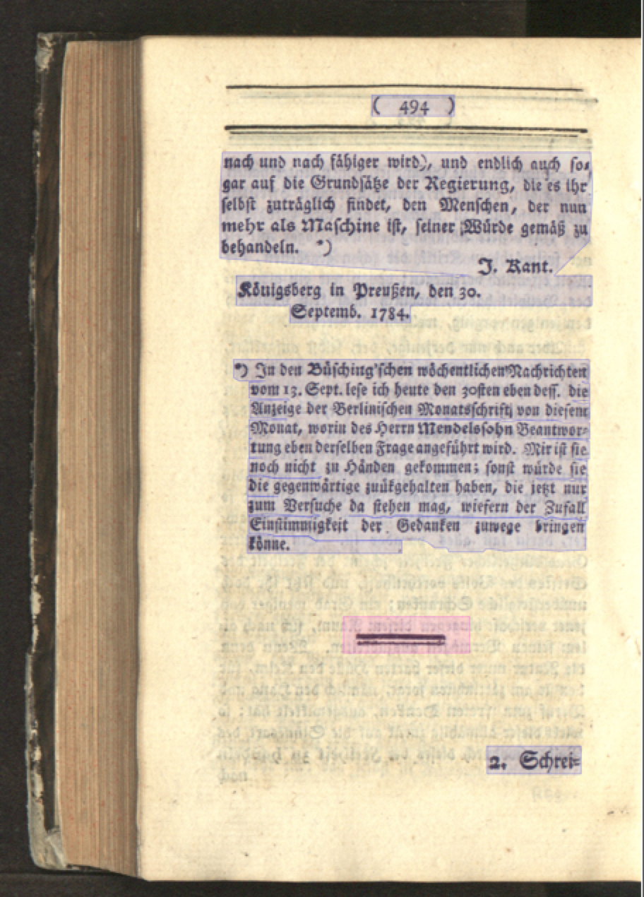

layout: true

---

class: title-slide

# `ocrd_segment`

## Data-driven page segmentation

Janek Schleicher, Robert Sachunsky, Kay-Michael Würzner

---

# The task

  1. Segment pages of printed documents
  2. Classify the segments according to their layout-semantic function

---

# The task

---

# The data

1. 180,000 annotated pages from the periodical *Die Grenzboten* (1841-1922)
    - Homogeneous layout
    - Completely annotated on page **and** volume level
2. 25,000 annotated pages from 3900 volumes of the *German Text Archive* (1506-1905)
    - Heterogeneous layout
    - Incompletely annotated on page **and** volume level
3. 1,000 annotated pages from 230 volumes of the *German Text Archive* (1738-1905)
    - Heterogeneous layout
    - Completely annotated on page (but not on volume) level

---

# Some questions

Build a data-driven framework with neural networks which performs the task of page segmentation and segment classification.

- Level of representation (pixel, bbox/polygon coordinates)?
- Image resolution (downscaling vs. exact coordinates)?
- General architecture (one or multiple classifiers)?
- Network architecture?
- Postprocessing (morphology, component analysis)?
- Preprocessing (binarization, deskewing, denoising, dewarping) and/or augmentation methods?

---

# The team

- Robert

  is a computational linguist from Dresden with backgrounds in speech signal processing and machine translation who works on OCR.

- Janek

  is a computer scientist from Berlin who has a strong background in machine learning and works on text generation.

- Kay

  is a computational linguist from Dresden who works on OCR and is interested in natural language processing in general.

---

# Our project

- DFG-funded initiative OCR-D
    + Improvement of methods and tooling for OCR of historical printings
    + Coordination project + 8 module projects
    + Working on
        * Format standards
        * Ground Truth data
        * Different processing stages of layout and text recognition
- Software stack at [github.com/OCR-D](https://github.com/OCR-D)
    + Specifications
    + Base API
    + Sample processors ([ocrd_segment](https://github.com/OCR-D/ocrd_segment) for this workshop)
